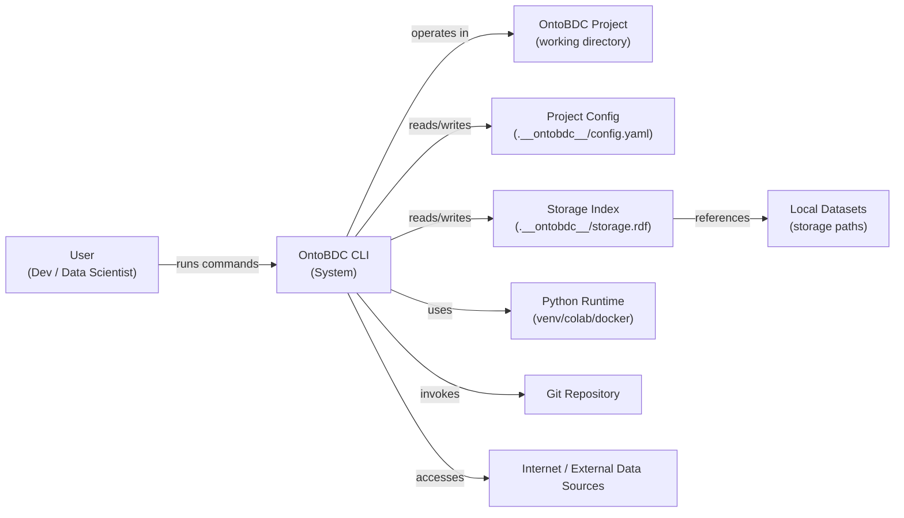
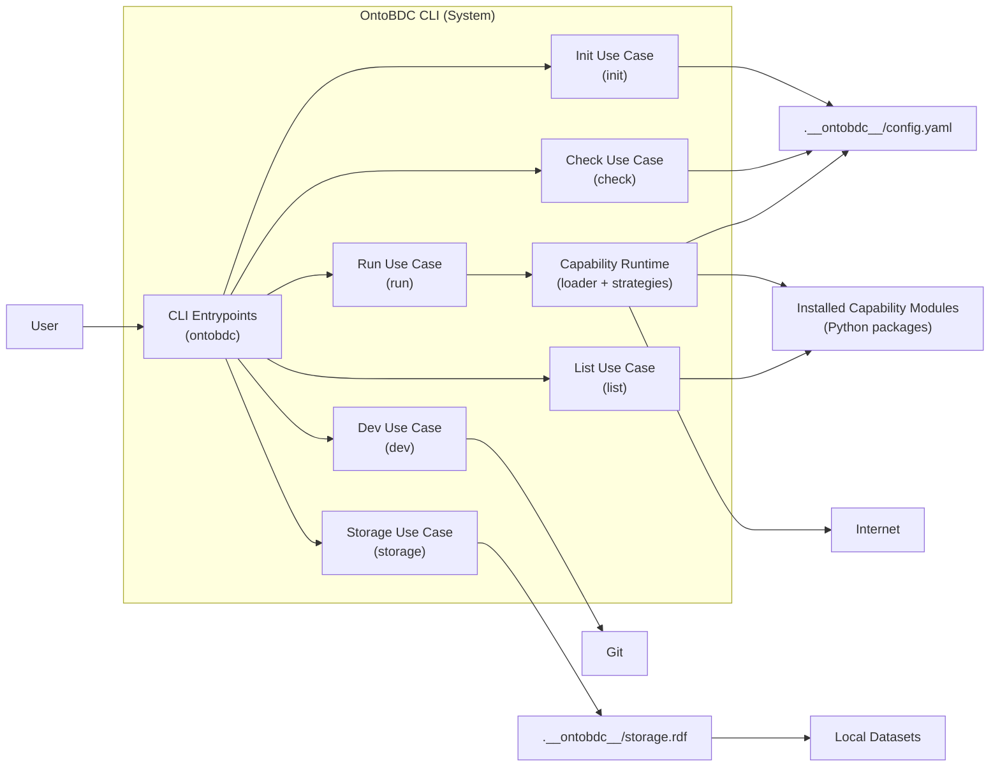

# OntoBDC

OntoBDC is a Python CLI and semantic runtime for defining, discovering, validating, and executing capability-based workflows over structured data and semantic context.

It is designed to make workflow execution predictable and auditable through explicit capability metadata, schema-driven inputs and outputs, and verification steps such as environment checks, contracts, and storage indexing.

In practice, OntoBDC focuses on:
*   **Context and Configuration Management:** Initializes and manages local project configuration in `.__ontobdc__` and runs pre-flight checks to reduce environment drift before execution.
*   **Capability Discovery and Execution:** Uses a plugin-based architecture to discover executable capabilities dynamically and expose them through the CLI.
*   **Storage Indexing:** Maintains a persistent RDF storage index (`storage.rdf`) that records dataset metadata and locations for consistent runtime references.
*   **State-Machine Orchestration:** Drives processes and transformations through explicit runtime states, with progress materialized in physical artifacts such as `raw.txt`, `parsed.json`, and `graph.ttl`.

Architecturally, OntoBDC is organized as a non-monolithic core with dependency injection across logical components such as `init`, `check`, `run`, `list`, `storage`, `dev`, and `a3`, while remaining extensible through additional features and capabilities.

The project is under active development and is especially suited to domains that require clear contracts, traceability, and high compliance, such as BIM/openBIM and engineering data pipelines.

## Documentation

- Specifications: [documentation/spec/](documentation/spec/)
- Roadmap And RFCs: [documentation/roadmap/README.md](documentation/roadmap/README.md)
- Tests: [documentation/test/README.md](documentation/test/README.md)
- Architecture Decisions: [documentation/adr/](documentation/adr/)

## Quickstart

1. Initialize a project context:
   - `ontobdc init`
2. Validate environment and configuration:
   - `ontobdc check`
3. Discover what is available:
   - `ontobdc list`
4. Execute a capability:
   - `ontobdc run <capability_id> [args]`
5. Manage the storage index:
   - `ontobdc storage`
   - `ontobdc storage --local [path]`
   - `ontobdc storage --remove <dataset_id>`

## What OntoBDC Does

- Creates and maintains a per-project configuration in `.__ontobdc__/config.yaml`.
- Runs pre-flight checks to reduce environment drift before execution.
- Discovers installed capabilities and exposes them through a consistent CLI.
- Executes capabilities using declared schemas and runtime strategies.
- Maintains a storage index (`.__ontobdc__/storage.rdf`) that references dataset locations.
- Supports workflows in domains that benefit from explicit contracts and auditability (e.g., BIM/openBIM, engineering data, compliance-oriented pipelines).

## Architecture

The diagrams below summarize the system context (C1) and the internal CLI containers (C2).

### C1 - System Context

### C2 - Container Diagram

## Core Concepts (Mental Model)

- Project Context: the `.__ontobdc__` folder that stores project state and metadata.
- Capability: an executable unit with explicit metadata, inputs, and outputs.
- Checks: deterministic validations to ensure the environment and prerequisites are correct before execution.
- Storage Index: an RDF index that registers dataset locations and enables repeatable references.

## Status

OntoBDC is under active development. The CLI is usable, but capabilities and workflows evolve quickly as the project expands its domain coverage and validation strategy.
