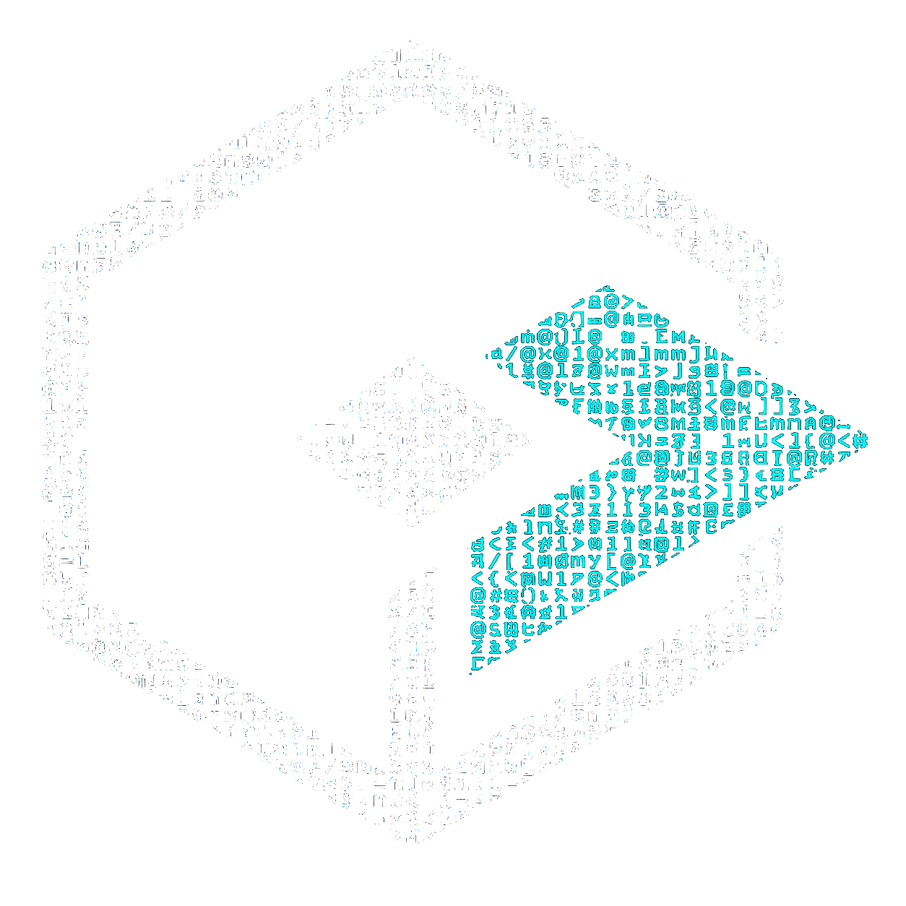

---
hide:
  - toc
---

  

    
  

  

    

      
      <h2 style="margin: 0; font-size: 1.5rem;">OntoBDC</h2>
      

        <strong style="color: var(--md-default-fg-color);" data-i18n="hero.strong_subtitle">Ontology-Based Datasets & Containers</strong>  
        A unified standard to define, distribute, and orchestrate open data datasets through code.
      

    

  

  

    <h2 data-i18n="capabilities.title">Do everything with capabilities</h2>
    
These are small executable scripts embedded directly within the "digital briefcase" (the .obdc pointer) that teach any computer or system on the network how to read, transform, or validate that specific dataset.

    

      

        <h3 data-i18n="capabilities.card1_title">🛡️ Data Sovereignty</h3>
        
Validate engineering projects locally (Edge Execution). Eliminate costly proprietary licenses and orchestrate sensitive data without transferring it to third-party infrastructures.

      

      

        <h3 data-i18n="capabilities.card2_title">⏳ Future-Proof</h3>
        
Project data must last decades. OntoBDC ensures your data and inspection tools can be reproduced identically 20 years from now, immunizing your organization against software obsolescence.

      

      

        <h3 data-i18n="capabilities.card3_title">🤖 AI-Ready</h3>
        
Using the container manifest as a structured guide, LLMs can autonomously trigger capabilities with less hallucinations, enabling advanced auditing without sending IP to Big Tech clouds.

      

    

  

  

    <h2 data-i18n="ownership.title">Your data is your data</h2>
    
OntoBDC embraces true open data principles. You retain full ownership, control, and accessibility of your engineering data without being tied to proprietary formats or vendor lock-in.

    

      

        <h3 data-i18n="ownership.card1_title">🎯 Single Source of Truth</h3>
        
You define the ultimate reference. Consolidate your engineering data into a single, reliable semantic model that governs all project rules and information.

      

      

        <h3 data-i18n="ownership.card2_title">🔄 Seamless Synchronization</h3>
        
Keep data flowing perfectly. Automatically synchronize information across multiple .obdc containers and integrate effortlessly with third-party systems.

      

      

        <h3 data-i18n="ownership.card3_title">🔌 Offline Local Execution</h3>
        
Work without limits. Process, validate, and query your complex data entirely offline, right on your machine, with zero dependency on internet connections.

      

    

  

  

    <h2 id="get_started" data-i18n="get_started.title">Get Started!</h2>
    
Choose the best way to experience and implement OntoBDC for your workflow.

    

      

        <h3 data-i18n="get_started.card1_title">🌐 Online Demo</h3>
        
Try OntoBDC directly in your browser without installing anything. Explore capabilities and see it in action.

        <a href="#" class="btn-primary" style="margin-top: 1.2rem; padding: 0.6rem 1.2rem; font-size: 0.9rem; text-align: center; align-self: center;" data-i18n="get_started.card1_btn">Try Online</a>
      

      

        <h3 data-i18n="get_started.card2_title">💻 Local CLI</h3>
        
Install via pip and initialize your first digital briefcase in seconds directly from your terminal.

        

          &gt;_ pip install ontobdc 
          &gt;_ ontobdc --version 
          &gt;_ ontobdc init
        

        <a href="#" class="btn-primary" style="margin-top: 1.2rem; padding: 0.6rem 1.2rem; font-size: 0.9rem; text-align: center; align-self: center;" data-i18n="get_started.card2_btn">Documentation</a>
      

      

        <h3 data-i18n="get_started.card3_title">☁️ Google Colab</h3>
        
Run OntoBDC in the cloud using Google Colab. Mount your Google Drive to seamlessly process and orchestrate your remote engineering data.

        <a href="#" class="btn-primary" style="margin-top: 1.2rem; padding: 0.6rem 1.2rem; font-size: 0.9rem; text-align: center; align-self: center;" data-i18n="get_started.card3_btn">Google Colab</a>
      

    

  

