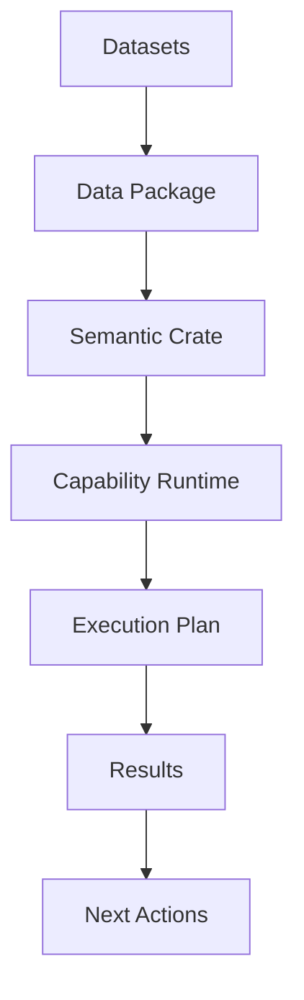

# OntoBDC: Ontology-Based Data Capabilities

## 1. Visão Geral

O **OntoBDC** é um runtime orientado a capabilities para execução de operações de dados conscientes de ontologia sobre datasets portáveis (*capability-driven runtime for executing ontology-aware data operations over portable datasets*).

Ele vai além do gerenciamento de dados, atuando como um motor de execução que entende o significado dos dados e orquestra operações modulares baseadas nesse entendimento. O sistema combina uma infraestrutura de dados semântica (Data Package + RO-Crate + System Crate) com um planejador de execução dinâmica.



## 2. Arquitetura de Camadas (Infraestrutura de Suporte)

A infraestrutura de dados fornece a base portável e semântica sobre a qual o runtime opera.

### 2.1. Camada de Dados (Data Package)
*   **Padrão**: Frictionless Data Package.
*   **Responsabilidade**: Dados brutos e estrutura física.
*   **Função**: Define "como está" o dado (CSV, JSON) e "de onde veio" (proveniência). É a verdade material editável por qualquer ferramenta externa.

### 2.2. Camada Semântica (Context Crate / OBDC)
*   **Padrão**: RO-Crate (Research Object Crate).
*   **Responsabilidade**: Significado, identidade e contexto.
*   **Função**: Define "o que é" (ontologia, instâncias, relações). Atua como um container semântico portátil que referencia o Data Package.

### 2.3. Camada de Sistema (System Crate)
*   **Responsabilidade**: Memória e eventos.
*   **Função**: "Espinha dorsal" de eventos (*event spine*) que registra alterações e mantém o estado de sincronização do sistema via Event Sourcing.

---

## 3. Capabilities e Runtime de Execução (O Coração Operacional)

Além da infraestrutura de dados, o OntoBDC fornece um runtime para execução de **Capabilities**. Capabilities são operações executáveis modulares definidas sobre datasets e contextos semânticos (*Capabilities are modular executable operations defined over datasets and semantic contexts*).

### 3.1. Estrutura de uma Capability
Uma Capability não é apenas um script; é um objeto gerenciado pelo runtime que possui:

*   **Lógica de Negócio**: Código Python encapsulado que realiza a operação.
*   **Metadados Ricos (Metadata)**:
    *   **ID Único**: Identificador global (ex: `org.ontobdc.capability.list_documents`).
    *   **Contrato de Entrada (Input Schema)**: Definição tipada do que a capability precisa para rodar (ex: `FileRepository`, `file_type: str`).
    *   **Contrato de Saída (Output Schema)**: O que ela produz (ex: `List[FilePath]`).
    *   **Nível de Poder**: Classificação de segurança e impacto.

### 3.2. Classificação de Capabilities (Níveis de Poder)
Para garantir a segurança e previsibilidade, as capabilities são divididas em níveis hierárquicos:

1.  **L1 - Capability (Senses)**:
    *   **Escopo**: Leitura e Descoberta (*Read-Only/Discovery*).
    *   **Efeito**: Puramente informacional, sem efeitos colaterais.
    *   **Exemplo**: `list_documents`, `check_syntax`, `get_metadata`.

2.  **L2 - Action (Hands)**:
    *   **Escopo**: Transformação e Criação (*Transformation/Creation*).
    *   **Efeito**: Local. Pode criar ou modificar arquivos, mas não altera o estado de negócio do workflow.
    *   **Exemplo**: `convert_pdf_to_text`, `extract_zip`, `generate_report`.

3.  **L3 - Use Case (Brain)**:
    *   **Escopo**: Transição de Estado (*State Transition*).
    *   **Efeito**: Global. Avança o fluxo de trabalho, altera status de projetos, orquestra L1 e L2.
    *   **Exemplo**: `process_incoming_data`, `archive_project`.

### 3.3. Planejamento de Execução (*Execution Planning*)
Quando uma capability é solicitada, o OntoBDC:

1.  Analisa as entradas exigidas pela capability.
2.  Busca outras capabilities capazes de produzir essas entradas.
3.  Constrói um plano de execução (*execution plan*).
4.  Executa os passos necessários na ordem correta.

O plano de execução pode ser inspecionado antes da execução real (comando `plan`), garantindo transparência e previsibilidade.

### 3.2. Descoberta de Capabilities (*Discovery*)
Capabilities podem ser descobertas dinamicamente baseadas nas entradas que elas aceitam.

Exemplo:
```bash
ontobdc run --input file-type=zip
```
O sistema listará todas as capabilities capazes de consumir esse tipo de entrada, facilitando a exploração das operações possíveis.

### 3.3. Sugestões Pós-Execução (*Next Actions*)
Após executar uma capability, o OntoBDC analisa as saídas produzidas e identifica outras capabilities que podem consumi-las.

Isso permite que o runtime sugira "próximas operações possíveis", habilitando fluxos de trabalho incrementais e exploratórios (*incremental and exploratory workflows*).

### 3.4. Capability Graph
O conjunto de capabilities e seus contratos de entrada/saída formam um grafo direcionado que o runtime utiliza para descobrir caminhos de execução possíveis (*capability dependency graph*).

*   Capability A → Output X
*   Capability B → Input X

Esse grafo permite ao sistema inferir automaticamente pipelines complexos de processamento apenas analisando os metadados das capabilities disponíveis.

## 4. OntoBDC Runtime Roles
O OntoBDC atua simultaneamente como:

1.  **Monitor**: Detecta mudanças no filesystem e gera eventos.
2.  **Executor**: Roda capabilities de forma isolada e segura.
3.  **Orquestrador**: Compõe capabilities em fluxos complexos baseados no grafo de dependências semânticas.

## 5. Diferenciais
*   **Portabilidade Total**: Projetos podem ser movidos fisicamente sem perda de contexto ou capacidade de execução.
*   **Desacoplamento**: Separação clara entre dado bruto, semântica e lógica de execução.
*   **Capability-Driven**: O sistema é guiado pelo que *pode ser feito* com os dados disponíveis, não por fluxos rígidos pré-definidos.
