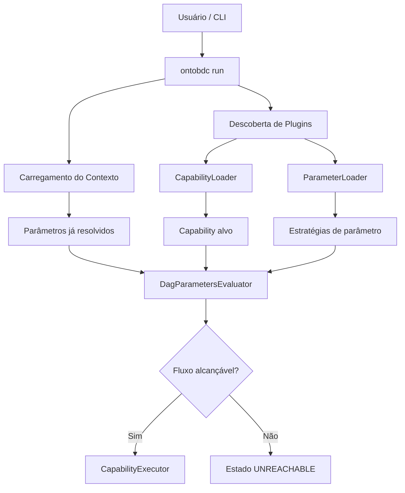
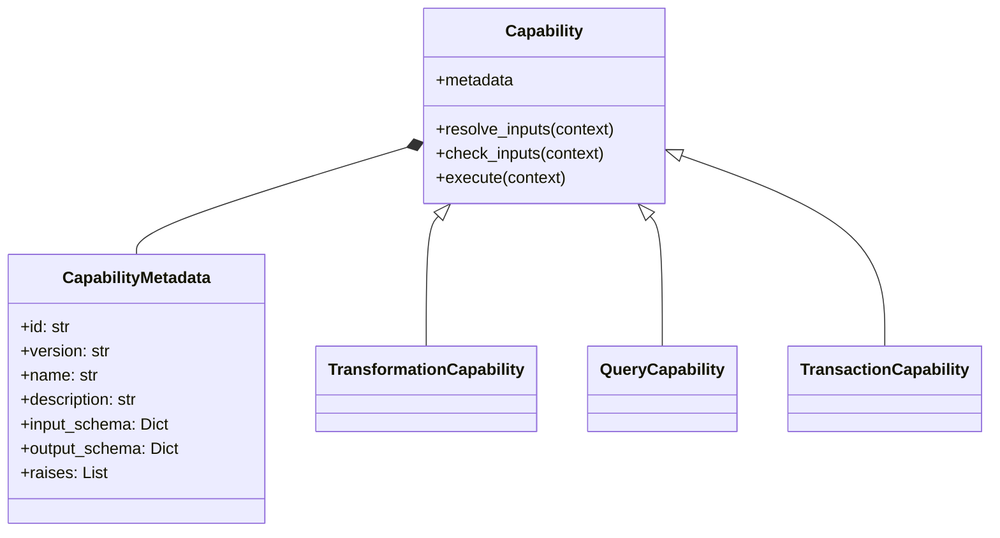
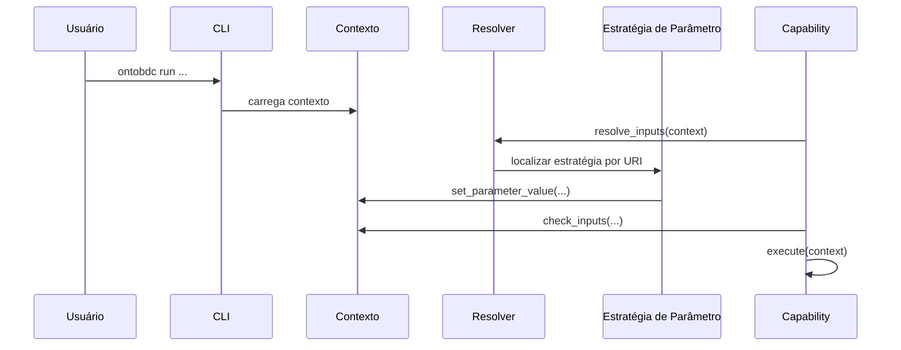
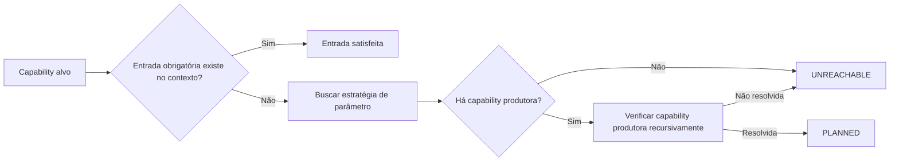
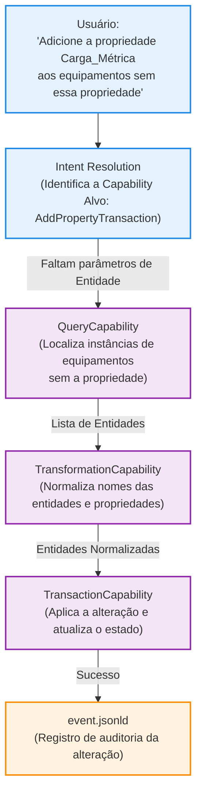

# OntoBDC
## Whitepaper Técnico: Arquitetura de Execução do OntoBDC Runtime

**Versão:** 0.9  
**Data:** 2026-06-09  
**Autores:** Equipe OntoBDC  
**Escopo:** motor de execução `run`, capabilities, parâmetros, contexto e planejamento por Reachability Graph  
**Fora de escopo:** detalhes internos dos componentes `storage` e `a3`

---

## Resumo Executivo

*OntoBDC is a contract-driven semantic runtime that performs deterministic reachability planning over typed capabilities. The runtime determines whether a workflow is resolvable before execution by matching capability contracts (input/output schemas) through a reachability graph. Natural language is optional; planning is schema-driven and deterministic.*

Em português: o OntoBDC é um runtime semântico orientado a contratos que executa planejamento determinístico de alcançabilidade sobre capabilities tipadas. Em vez de executar DAGs de tarefas previamente autorados ou depender de seleção de tools dirigida por LLM, o sistema determina se um fluxo é resolvível antes da execução, compatibilizando contratos de entrada e saída por meio de um Reachability Graph.

Essa é a contribuição arquitetural central do `ontobdc run`: **Reachability Planning over Typed Capabilities**. Todo o restante, incluindo linguagem natural, query, transaction, plugins, contexto persistido e estratégias de parâmetro, existe para alimentar ou consumir esse mecanismo. A linguagem natural, em particular, é apenas uma interface opcional. O núcleo do sistema não é um wrapper de modelos de linguagem, mas um mecanismo de planejamento schema-driven e determinístico.

Essa arquitetura permite unificar workflows de consulta, transformação e transação em um único modelo de execução, com contratos explícitos, tipagem semântica e rastreabilidade auditável. Este documento apresenta o problema que essa arquitetura endereça, os objetivos de design do runtime, os contratos centrais do modelo de capabilities e o mecanismo de Reachability Planning utilizado pelo OntoBDC, sem entrar nos detalhes específicos dos módulos de armazenamento ou da máquina de estados A3.

```mermaid
flowchart LR
    Q[QueryCapability<br/>produz List[Entity]]
    T[TransformationCapability<br/>normaliza EntityName]
    X[TransactionCapability<br/>consome EntityName + Property]

    Q -->|schema compatibility| T
    T -->|schema compatibility| X
```

*Edges are derived from schema compatibility, not manually authored execution order.*

---

## Sumário

1. Problema e motivação
2. Objetivos de arquitetura
3. Visão geral da solução
4. Modelo operacional do `ontobdc run`
5. Capabilities e contrato de execução
6. Contexto e parâmetros
7. Planejamento por Reachability Graph
8. Exemplo concreto de capability
9. Casos de uso
10. Posicionamento arquitetural
11. Diretrizes de adoção
12. Limites e não objetivos
13. Visão de Longo Prazo
14. Conclusão
15. Referências

---

## 1. Problema e Motivação

Pipelines de linha de comando e interfaces orientadas a dados costumam sofrer com seis problemas recorrentes:

1. **Acoplamento excessivo entre etapas**: uma rotina depende de outra por convenção, e não por contrato.
2. **Parâmetros implícitos**: dados críticos circulam em variáveis soltas, arquivos temporários ou flags sem tipagem verificável.
3. **Baixa auditabilidade**: quando uma etapa falha, é difícil explicar se o problema foi de entrada ausente, ordem de execução ou incapacidade estrutural do fluxo.
4. **Baixa extensibilidade**: adicionar uma nova rotina normalmente exige alterar o motor principal ou duplicar lógica de despacho.
5. **Consulta complexa para usuários não técnicos**: extrair dados de ontologias, grafos de conhecimento ou repositórios semânticos normalmente exige SQL, SPARQL, Python ou ferramentas especializadas. Usuários de domínio não conseguem fazer perguntas operacionais simples sem depender de um intermediário técnico.
6. **Edição de dados dependente de script**: atualizar ontologias, modelos ou bases semânticas costuma exigir TRANSACT-SPARQL, APIs específicas ou interfaces gráficas limitadas, o que dificulta operações simples de manutenção e enriquecimento.

No contexto do OntoBDC, esse problema é especialmente relevante porque a execução pode depender de intenções do usuário, parâmetros inferidos, resolução semântica e composição de capacidades descobertas dinamicamente. Um modelo puramente imperativo tende a espalhar regras de resolução, validação e despacho por múltiplos pontos do sistema, e isso piora quando o mesmo runtime precisa suportar leitura, transformação e escrita de dados com a mesma coerência operacional. O **Contract-Based Planning** resolve isso avaliando alcançabilidade antes da execução.

O componente `ontobdc run` foi projetado para tratar esse problema como uma questão de **contrato de execução**. Em vez de perguntar apenas "qual função devo chamar?", o runtime pergunta:

- qual capability foi selecionada;
- quais entradas ela exige;
- quais dessas entradas já estão preenchidas no contexto;
- quais entradas podem ser produzidas por outras capabilities;
- se a intenção do usuário corresponde a uma operação de consulta, transformação ou transação;
- se o fluxo completo é resolvível antes da execução.

---

## 2. Objetivos de Arquitetura

*OntoBDC is a contract-driven semantic runtime that performs deterministic reachability planning over typed capabilities, enabling query, transformation and transaction workflows from a unified execution model.*

Em português: O OntoBDC é um runtime semântico orientado a contratos que executa planejamento determinístico de alcançabilidade sobre capabilities tipadas, habilitando fluxos de consulta, transformação e transação a partir de um modelo de execução unificado.

O design do `ontobdc run` persegue os seguintes objetivos:

- **Contract-Based Planning**: o runtime planeja execução baseada em schemas formais de entrada/saída, não em prompts de linguagem natural. Isso garante determinismo e evita alucinações de LLM.
- **Descoberta dinâmica**: capabilities e estratégias de parâmetro devem ser carregadas sem cadastro manual no núcleo.
- **Contratos explícitos**: cada capability declara `input_schema`, `output_schema`, exceções e metadados.
- **Resolução orientada a contexto**: entradas podem vir da CLI, de contexto persistido ou de capabilities produtoras.
- **Planejamento antes da execução**: o runtime deve avaliar alcançabilidade antes de disparar a capability alvo.
- **Baixo acoplamento**: o motor não deve conhecer a lógica de domínio de cada capability.
- **Rastreabilidade**: estados e parâmetros precisam ser inspecionáveis ao longo do fluxo.

Esses objetivos aparecem diretamente na implementação de `CapabilityMetadata`, `CliContextPort`, `CapabilityExecutor`, `CapabilityLoader`, `ParameterLoader` e `DagParametersEvaluator`.

---

## 3. Visão Geral da Solução

Em alto nível, o comando `ontobdc run` funciona como um runtime declarativo para três tipos de uso distintos: transformação, consulta e edição. O processo geral combina descoberta de plugins, resolução de intenção, seleção da capability alvo, análise de parâmetros ausentes e resolução de alcançabilidade.

### 3.1 Transformação

- **Objetivo**: extrair, transformar, validar, enriquecer ou derivar dados.
- **Tipo de capability**: `TransformationCapability`.
- **Exemplo de uso**: normalizar um conjunto de dados, traduzir um pacote semântico ou materializar um novo estado de processamento.

### 3.2 Consulta

- **Objetivo**: responder perguntas em linguagem natural sobre dados e modelos.
- **Tipo de capability**: `QueryCapability`.
- **Exemplo de uso**: `ontobdc run "quantas instâncias têm a propriedade X ausente?"`.
- **Resultado esperado**: lista estruturada, tabela, JSON ou resposta textual consolidada.

### 3.3 Edição

- **Objetivo**: modificar dados existentes com validação de pré-condições.
- **Tipo de capability**: `TransactionCapability`.
- **Exemplo de uso**: `ontobdc run "adicione a propriedade Y à entidade Z"`.
- **Resultado esperado**: confirmação da mudança, estado atualizado e eventuais artefatos de rastreabilidade.



O papel do runtime não é "executar tudo". O papel do runtime é **decidir, validar, planejar e então executar**, independentemente do tipo de capability selecionada.

---

## 4. Modelo Operacional do `ontobdc run`

O fluxo observado no código pode ser resumido em cinco blocos.

### 4.1 Descoberta

O OntoBDC utiliza loaders para localizar plugins em diretórios padronizados. O `CapabilityLoader` descobre classes derivadas de `Capability`; o `ParameterLoader` descobre estratégias derivadas de `CliContextStrategyPort`.

Essa estratégia reduz o acoplamento entre o núcleo do runtime e os módulos instalados. O motor descobre o que existe; ele não precisa listar manualmente cada capability conhecida, seja ela voltada a consulta, transformação ou edição de dados.

### 4.2 Contextualização

O `CliContextAdapter` encapsula argumentos brutos, argumentos ainda não processados, idioma, root path e parâmetros persistidos ou resolvidos em memória. Parte do contexto é serializada em `context.ttl`, permitindo continuidade entre etapas do fluxo.

### 4.3 Resolução de intenção

O runtime trabalha com estados de resolução, como `LANGUAGE_DEFINED`, `INTENDED`, `PARSED`, `VALIDATED`, `PLANNED`, `FILLED` e `UNREACHABLE`. Esses estados ajudam a separar:

- entendimento da intenção do usuário;
- seleção da capability correta;
- preenchimento de insumos necessários;
- prontidão real para executar.

### 4.4 Planejamento

Antes de executar a capability alvo, o `DagParametersEvaluator` identifica parâmetros obrigatórios ausentes e verifica se eles podem ser satisfeitos pelo contexto atual ou por capabilities produtoras compatíveis.

### 4.5 Execução

Somente após `resolve_inputs()` e `check_inputs()` a capability é executada por `CapabilityExecutor.execute()`.

---

## 5. Capabilities e Contrato de Execução

No OntoBDC, uma capability é a unidade mínima de processamento. O contrato é definido pela classe `CapabilityMetadata` e pela interface operacional da classe base `Capability`.

O ponto importante aqui é que "capability" não é sinônimo de transformação. O runtime já distingue três famílias principais:

- `QueryCapability`: capabilities voltadas a consulta e recuperação de informação;
- `TransformationCapability`: capabilities voltadas a derivação, normalização, enriquecimento ou conversão;
- `TransactionCapability`: capabilities voltadas a criação, atualização, remoção ou qualquer efeito persistente sobre dados.

### 5.1 O que a metadata descreve

A metadata não é apenas documentação. Ela é parte operacional do runtime. Entre os campos mais relevantes:

- `id`: identificador único global da capability.
- `version`: versão do contrato.
- `name` e `description`: identificação humana.
- `tags` e `supported_languages`: apoio a descoberta e internacionalização.
- `require`: dependências declaradas.
- `input_schema`: entradas esperadas.
- `output_schema`: saídas prometidas.
- `raises`: exceções contratuais relevantes.

### 5.2 O que a capability precisa fazer

Toda capability concreta implementa:

- `label(lang)`
- `description(lang)`
- `execute(context)`

Além disso, herda comportamento comum para:

- resolver entradas por URI com `resolve_inputs()`;
- validar presença, tipo e verificações adicionais com `check_inputs()`.

**Exemplos de subtipos de capability:**

| Tipo | Uso principal | Exemplo de resultado |
|---|---|---|
| `TransformationCapability` | Transformação de dados e derivação de artefatos | `raw_data -> clean_data` |
| `QueryCapability` | Consulta em linguagem natural | `pergunta -> lista/contagem/resposta estruturada` |
| `TransactionCapability` | Edição em linguagem natural | `comando -> confirmação + estado alterado` |



### 5.3 Consulta e edição em linguagem natural

Como o `run` passa por resolução de intenção antes da execução, o OntoBDC pode usar a mesma infraestrutura para interpretar pedidos como:

- "listar os dados disponíveis sobre X";
- "buscar o recurso relacionado a Y";
- "atualizar o valor Z";
- "adicionar um novo item com tais propriedades".

O que muda entre esses casos não é o runtime, mas a capability alvo e seu contrato. Isso é relevante porque elimina a necessidade de construir um mecanismo separado para consultas em linguagem natural e outro para mutações: ambos passam pela mesma cadeia de resolução, validação e execução.

### 5.4 Implicação arquitetural

Esse desenho separa claramente três níveis:

1. **declaração** do contrato;
2. **resolução e validação** de insumos;
3. **regra de negócio** da execução.

Isso reduz duplicação e facilita adicionar novas capabilities sem alterar o motor principal.

---

## 6. Contexto e Parâmetros

O contexto é a estrutura que conecta CLI, resolução semântica e execução. Ele funciona como um repositório operacional de estado curto e de parâmetros resolvidos.

### 6.1 O que o contexto mantém

Pelo contrato `CliContextPort`, o runtime consegue acessar:

- argumentos crus (`raw_args`);
- argumentos ainda não processados (`unprocessed_args`);
- capability alvo (`target_capability_id`);
- idioma;
- caminho raiz;
- leitura, escrita, remoção e limpeza de parâmetros.

### 6.2 Tipagem forte

O método `check_inputs()` valida tipos declarados em `input_schema`. Isso permite, por exemplo, distinguir entre:

- `str`
- `int`
- `bool`
- tipos Python concretos, como `Path` ou `CliContextPort`

Esse ponto é importante porque o runtime não trata parâmetro apenas como texto de CLI. O parâmetro é tratado como **valor com semântica operacional**.

### 6.3 Resolução por URI

Quando uma propriedade de `input_schema` declara um `uri`, a capability pode delegar o preenchimento a um `CapabilityParamResolverRunner`. Isso conecta o modelo operacional ao vocabulário semântico do projeto e permite que o runtime procure estratégias adequadas para satisfazer uma entrada.



---

## 7. Planejamento por Reachability Graph

O OntoBDC não monta um DAG genérico de execução. O que ele faz é avaliar se a capability alvo é **alcançável** com base em um **Reachability Graph** (Grafo de Resolubilidade).

### 7.1 Como a avaliação funciona

O `DagParametersEvaluator` (nome do componente, atuando como um avaliador de alcançabilidade) executa quatro passos centrais:

1. localiza a capability alvo a partir de `capability_id`;
2. identifica propriedades obrigatórias do `input_schema`;
3. verifica quais entradas já estão preenchidas no contexto;
4. para cada entrada ausente, procura uma estratégia de parâmetro e capabilities que possam produzi-la.

### 7.2 Busca recursiva por produtores

Se um parâmetro ausente pode ser produzido por outra capability, o avaliador entra recursivamente nessa capability produtora e verifica se ela própria é resolvível. Se houver ciclo ou ausência de produtores, o plano é marcado como inviável.

### 7.3 Estados resultantes

Essa análise alimenta estados operacionais claros:

- `PLANNED`: existe plano de suporte para preencher entradas faltantes;
- `FILLED`: todas as entradas obrigatórias já estão preenchidas;
- `UNREACHABLE`: não há caminho resolvível com o contexto e os produtores disponíveis.



### 7.4 Por que isso importa

Essa abordagem desloca parte da complexidade da execução para a etapa de planejamento. O resultado é simples de explicar:

- a execução não começa sem contrato atendido;
- o usuário consegue distinguir falta de entrada de inviabilidade estrutural;
- novas capabilities podem entrar no ecossistema desde que descrevam corretamente suas entradas e saídas.

---

## 8. Exemplo Concreto de Capability

O trecho abaixo sintetiza o padrão já utilizado no código do OntoBDC. Os exemplos são reduzidos, mas seguem o contrato real de `CapabilityMetadata` e mostram como o mesmo runtime pode operar sobre transformação, consulta e transação.

### 8.1 Exemplo: `TransformationCapability`

```python
from typing import Any, Dict
from ontobdc.shared.domain.port.context import CliContextPort
from ontobdc.shared.domain.resource.capability import (
    CapabilityMetadata,
    TransformationCapability,
)


class ExampleCapability(TransformationCapability):
    METADATA = CapabilityMetadata(
        id="org.ontobdc.example.capability.normalize",
        version="0.1.0",
        name="Normalization",
        description="Normalize a user-provided value.",
        author=["OntoBDC"],
        input_schema={
            "type": "object",
            "properties": {
                "raw_value": {
                    "type": "string",
                    "required": True,
                    "uri": "http://ontobdc.org/ontology/domain/ns.ttl#RawValue",
                }
            },
        },
        output_schema={
            "type": "object",
            "properties": {
                "normalized_value": {
                    "type": "string",
                }
            },
        },
    )

    def label(self, lang: str = "en") -> str:
        return "Normalization"

    def description(self, lang: str = "en") -> str:
        return "Normalize a user-provided value."

    def execute(self, context: CliContextPort) -> Dict[str, Any]:
        raw_value = context.get_parameter_value("raw_value")
        return {"normalized_value": raw_value.strip().lower()}
```

### 8.2 Exemplo: `QueryCapability`

```python
from typing import Any, Dict
from ontobdc.shared.domain.port.context import CliContextPort
from ontobdc.shared.domain.resource.capability import (
    CapabilityMetadata,
    QueryCapability,
)


class PropertyQueryCapability(QueryCapability):
    METADATA = CapabilityMetadata(
        id="org.ontobdc.query.semantic.instances_with_missing_prop",
        version="0.1.0",
        name="Instances with Missing Property",
        description="Query semantic instances that lack a specific property.",
        author=["OntoBDC"],
        input_schema={
            "type": "object",
            "properties": {
                "property_name": {
                    "type": "string",
                    "required": True,
                    "uri": "http://ontobdc.org/ontology/domain/ns.ttl#PropertyName",
                },
                "dataset_path": {
                    "type": "string",
                    "required": True,
                    "uri": "http://ontobdc.org/ontology/domain/ns.ttl#DatasetPath",
                },
            },
        },
        output_schema={
            "type": "object",
            "properties": {
                "instances": {"type": "array"},
                "count": {"type": "integer"},
            },
        },
    )

    def label(self, lang: str = "en") -> str:
        return "Instances with Missing Property"

    def description(self, lang: str = "en") -> str:
        return "Query semantic instances that lack a specific property."

    def execute(self, context: CliContextPort) -> Dict[str, Any]:
        prop_name = context.get_parameter_value("property_name")
        dataset_path = context.get_parameter_value("dataset_path")
        results = self._execute_query(prop_name, dataset_path)
        return {"instances": results, "count": len(results)}
```

**Uso em linguagem natural:**

```bash
ontobdc run "quantas instâncias têm a propriedade 'Carga_Métrica' ausente?" \
  --dataset-path ./datasets/ds01.ttl
```

### 8.3 Exemplo: `TransactionCapability`

```python
from typing import Any, Dict
from ontobdc.shared.domain.port.context import CliContextPort
from ontobdc.shared.domain.resource.capability import (
    CapabilityMetadata,
    TransactionCapability,
)


class AddPropertyTransaction(TransactionCapability):
    METADATA = CapabilityMetadata(
        id="org.ontobdc.transaction.semantic.add_property",
        version="0.1.0",
        name="Add Property to Entity",
        description="Add a custom property to a semantic entity.",
        author=["OntoBDC"],
        input_schema={
            "type": "object",
            "properties": {
                "entity_name": {"type": "string", "required": True},
                "property_name": {"type": "string", "required": True},
                "property_type": {"type": "string", "required": True},
            },
        },
        output_schema={
            "type": "object",
            "properties": {
                "success": {"type": "boolean"},
                "message": {"type": "string"},
            },
        },
    )

    def label(self, lang: str = "en") -> str:
        return "Add Property to Entity"

    def description(self, lang: str = "en") -> str:
        return "Add a custom property to a semantic entity."

    def execute(self, context: CliContextPort) -> Dict[str, Any]:
        entity = context.get_parameter_value("entity_name")
        prop = context.get_parameter_value("property_name")
        prop_type = context.get_parameter_value("property_type")
        success = self._apply_update(entity, prop, prop_type)
        return {
            "success": success,
            "message": f"Property '{prop}' added to entity '{entity}'" if success else "Failed",
        }
```

**Uso em linguagem natural:**

```bash
ontobdc run "adicione a propriedade 'Carga_Métrica' do tipo número à entidade 'Equipamento_01'"
```

### 8.4 Exemplo de Fluxo Completo (Intent to Execution)

Para ilustrar o poder da composição de Capabilities e do Reachability Graph, considere a seguinte intenção de usuário submetida via CLI ou API:

> *"Adicione a propriedade Carga_Métrica aos equipamentos sem essa propriedade"*

Abaixo, o fluxo arquitetural de como o OntoBDC processa essa instrução sem delegar o planejamento das ações a um LLM.



**O que acontece sob o capô:**
1. **Intent Resolution**: O sistema mapeia a intenção para a `TransactionCapability` de adicionar propriedades.
2. **Reachability Evaluation**: O avaliador percebe que a Capability alvo exige a lista de instâncias (`entity_name`), que não foi fornecida explicitamente no texto.
3. **Resolução de Parâmetros**: O avaliador encontra uma `QueryCapability` capaz de buscar "equipamentos sem a propriedade Carga_Métrica".
4. **Alcançabilidade**: O runtime valida que os schemas se encaixam e que a execução é viável (estado `PLANNED`).
5. **Execução**: Somente então o runtime dispara a cadeia, culminando na transação e na geração de um evento de auditoria rastreável.

O ponto principal não é a lógica específica de cada exemplo. O ponto principal é o modelo:

- a capability declara suas entradas;
- o runtime tenta resolvê-las;
- o runtime valida tipos;
- a execução consome apenas o que foi formalmente disponibilizado no contexto.

---

## 9. Casos de Uso

Mesmo sem detalhar `storage` e `a3`, o modelo do `run` atende a cenários claros.

### 9.1 Resolução de intenção para CLI semântica

O usuário não precisa necessariamente fornecer um fluxo inteiro; ele pode fornecer uma intenção, e o runtime avança pelos estados de resolução até identificar a capability alvo e os parâmetros necessários.

### 9.2 Consulta de dados em linguagem natural

O usuário pode expressar uma necessidade informacional em linguagem natural, e o runtime pode resolver a intenção até uma `QueryCapability` apropriada. A vantagem arquitetural é que a consulta deixa de ser um atalho fora do sistema e passa a ser uma operação formalizada por schema, contexto e validação.

Exemplos de perguntas possíveis:

- "quantas instâncias têm a propriedade X ausente?"
- "quais elementos possuem classificação Y no nível 3?"
- "listar todos os recursos com o atributo Z não preenchido"

### 9.3 Edição transacional guiada por intenção

Pedidos de criação, atualização ou remoção também podem ser modelados como capabilities transacionais. Isso permite tratar edição de dados com o mesmo rigor aplicado às transformações: entradas obrigatórias, resolução semântica, verificação de tipos e possibilidade de planejamento antes da execução.

Exemplos de comandos possíveis:

- "adicione propriedade 'Custo_M2' à entidade M_Equipamento_01"
- "altere a classe de todos os nós do nível 2 para concreto"
- "remova o elemento identificado por X"

### 9.4 Composição de pipelines orientados a contrato

Se uma capability precisa de um parâmetro que outra produz, o runtime pode reconhecer essa relação sem script imperativo externo.

### 9.5 Execução auditável em domínios regulados

Quando o objetivo é rastrear entradas, transformação e pré-condições, um fluxo baseado em metadata, contexto e estados explícitos é mais fácil de inspecionar do que um shell script linear.

---

## 10. Posicionamento Arquitetural

O diferencial do OntoBDC não está em oferecer apenas mais uma CLI semântica, um catálogo de plugins ou uma interface opcional em linguagem natural. O diferencial está em **Reachability Planning over Typed Capabilities**. A comparação com outras ferramentas fica mais clara quando esse mecanismo é tratado como o eixo central da arquitetura.

### 10.1 Comparação por mecanismo de planejamento

| Ferramenta | Mecanismo central | Limite arquitetural |
|---|---|---|
| Airflow / Dagster | DAG de tarefas definido pelo usuário; dependências explícitas | Executa ordem previamente autorada, mas não resolve compatibilidade semântica entre contratos antes da execução |
| LangGraph / CrewAI | Planejamento delegado ao LLM; seleção dinâmica de tools | Comportamento potencialmente não determinístico, sujeito a loops e alucinação de parâmetros |
| MCP | Camada de transporte de tools e contexto para LLMs | Não oferece planejamento transacional ou resolubilidade ponta a ponta |
| OntoBDC | Reachability Planning baseado em contratos tipados | Resolve dependências por compatibilidade de schema antes da execução |

### 10.2 Airflow e Dagster

Em Airflow ou Dagster, a ordem de execução é explícita e definida pelo autor do workflow. O sistema responde à pergunta "qual tarefa vem depois?".

No OntoBDC, a pergunta central é outra: "a capability alvo é resolvível com base nos contratos disponíveis?". O runtime deriva o Reachability Graph a partir de compatibilidade entre `input_schema` e `output_schema`, em vez de depender de uma ordem fixa escrita manualmente.

### 10.3 LangGraph e CrewAI

Em frameworks de agentes, o planejamento e a seleção de tools são tipicamente delegados ao LLM. Isso facilita prototipagem, mas introduz comportamento não determinístico.

O OntoBDC usa **Contract-Based Planning**: um algoritmo determinístico de resolubilidade orientado por schemas. A linguagem natural pode ajudar a extrair intenção, mas não decide a estrutura do plano. O plano emerge da compatibilidade de contratos, não de raciocínio estocástico.

### 10.4 MCP

O MCP é complementar, não concorrente. Ele opera como camada de transporte para expor contexto e tools a clientes LLM.

- **MCP = camada de transporte**
- **OntoBDC = camada de execução**

Uma capability do OntoBDC pode ser exposta via MCP, mas o OntoBDC continua responsável pelo planejamento de alcançabilidade, pela execução transacional e pela rastreabilidade do fluxo.

### 10.5 Tool Calling

Uma leitura superficial pode sugerir que "Capabilities" são apenas "Tools" de LLM. A diferença estrutural é que o OntoBDC não para na chamada da ferramenta: ele calcula resolubilidade antes da execução.

| Conceito OntoBDC | Equivalente aproximado | Diferença essencial |
|---|---|---|
| `Capability` | Tool / Function Calling | Publica contrato formal de entrada e saída com semântica explícita |
| `Context` | Agent State / Memory | Serve como superfície determinística de resolução de parâmetros |
| Reachability Planning | Planner / Tool Selection | Não depende de inferência livre do LLM; depende de compatibilidade entre schemas |
| `QueryCapability` | Retrieval Tool | Produz saídas tipadas e auditáveis |
| `TransactionCapability` | Action Tool | Opera sob controles transacionais e trilhas de auditoria |

Em suma, o OntoBDC não se distingue por "usar linguagem natural". Ele se distingue por tratar workflows semânticos como problemas de resolubilidade baseada em contratos tipados.

---

## 11. Diretrizes de Adoção

Para integrar novas capabilities ao `ontobdc run`, a recomendação é:

1. definir um `id` estável e semanticamente claro;
2. modelar `input_schema` e `output_schema` com precisão;
3. usar tipos concretos sempre que possível;
4. declarar `uri` quando a entrada puder ser resolvida semanticamente;
5. manter a lógica de domínio dentro de `execute()`, não no runtime;
6. evitar side effects implícitos fora do contexto ou do contrato declarado.

Em termos práticos, a qualidade do planejamento do runtime depende da qualidade da metadata publicada pelas capabilities e estratégias de parâmetro.

---

## 12. Limites e Não Objetivos

Este whitepaper não afirma que o OntoBDC resolve todos os problemas de orquestração. Em especial:

- não discute escalabilidade distribuída;
- não apresenta benchmark de throughput ou latência;
- não cobre agendamento temporal, filas externas ou execução multi-worker;
- não detalha os componentes `storage` e `a3`;
- não substitui a documentação de API ou as especificações formais do projeto.

O objetivo aqui é explicar a arquitetura de execução do `run`, não esgotar o sistema inteiro.

---

## 13. Visão de Longo Prazo: Sistema Operacional para Conhecimento

O `ontobdc run` não é apenas um motor de capabilities; ele é a camada de execução de uma visão arquitetural mais ampla. Freqüentemente, descrevemos o OntoBDC como um **Sistema Operacional para Conhecimento**.

A visão de longo prazo é tratar datasets, ontologias, contexto e eventos como componentes de um sistema operacional para conhecimento. Entretanto, a contribuição arquitetural deste whitepaper é mais específica: o mecanismo de **Reachability Planning over Typed Capabilities**.

Em um sistema operacional clássico (como Linux ou Windows), processos são gerenciados, recursos de hardware são alocados e arquivos são manipulados através de chamadas de sistema (syscalls). No OntoBDC:

- **Datasets e Ontologias** são o sistema de arquivos;
- **Contextos e Máquinas de Estado (`a3`)** são a memória e o gerenciamento de processos;
- **Eventos (JSON-LD)** são os logs de sistema auditáveis;
- **Capabilities** são os binários/comandos executáveis;
- **O Runtime (`run`)** é o kernel que agenda, avalia alcançabilidade e garante contratos.

Nessa visão, as capabilities descritas neste whitepaper são apenas as "peças em movimento" operando sobre um ecossistema persistente e federado de conhecimento. No futuro, espera-se que desenvolvedores não escrevam mais rotinas de integração frágeis, mas sim declarem Capabilities que o "SO" orquestrará de forma autônoma para resolver intenções de domínio.

---

## 14. Conclusão

*OntoBDC is a contract-driven semantic runtime that performs deterministic reachability planning over typed capabilities, enabling query, transformation and transaction workflows from a unified execution model.*

Em português: o valor arquitetural do `ontobdc run` está em tratar execução como combinação de **Reachability Planning over Typed Capabilities**, contexto e contratos explícitos, independentemente do tipo de operação:

- **transformação** para ETL, validação e derivação de artefatos;
- **consulta** para responder perguntas em linguagem natural sobre dados e modelos;
- **edição** para aplicar mudanças com validação e rastreabilidade.

A capability não entra no runtime como código solto; ela entra como unidade formal com entrada, saída, semântica e verificações declaradas. O contexto não é apenas uma estrutura auxiliar; ele é a superfície operacional pela qual a CLI, os resolvers e as capabilities se conectam. O Reachability Graph, por sua vez, não é um recurso decorativo: ele materializa a análise de alcançabilidade do fluxo antes da execução.

Esse desenho é particularmente útil quando o sistema precisa evoluir por plugins, manter rastreabilidade e evitar dependências implícitas entre etapas. Query, transformation e transaction não são a tese central; são consequências do mesmo mecanismo de planejamento determinístico. A mesma infraestrutura suporta consulta e edição em linguagem natural porque essas operações também são publicadas como capabilities com contratos explícitos. Como próximos passos, a evolução natural desse modelo inclui ampliar a documentação formal dos estados de resolução, expandir exemplos de capabilities reais e consolidar guias de integração para autores de plugins.

---

## 15. Referências

### 15.1 Referências internas do projeto

- `ontobdc/shared/domain/resource/capability.py`
- `ontobdc/shared/domain/port/context.py`
- `ontobdc/shared/adapter/context.py`
- `ontobdc/shared/adapter/plugin.py`
- `ontobdc/run/adapter/evaluator.py`
- `ontobdc/run/domain/machine/lifecycle.py`

### 15.2 Referências conceituais

- Reachability graphs para modelagem de resolubilidade
- Contratos de entrada e saída inspirados em schema-driven execution
- Arquiteturas orientadas a plugins para extensão desacoplada
