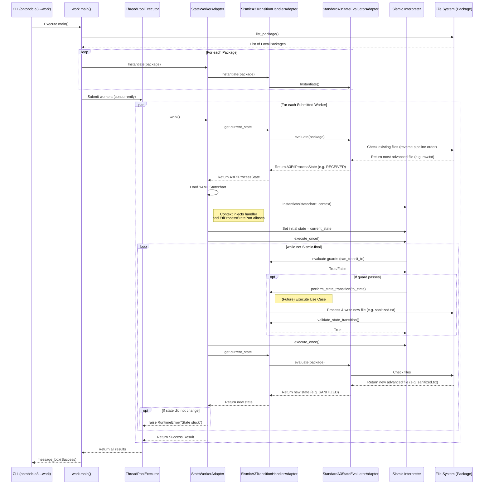

# A3 Work Pipeline Sequence

This diagram illustrates the sequence of operations when executing the `ontobdc a3 --work` command. It shows how the concurrent workers, the physical package state evaluator, and the Sismic state machine interact to process each ETL package.

