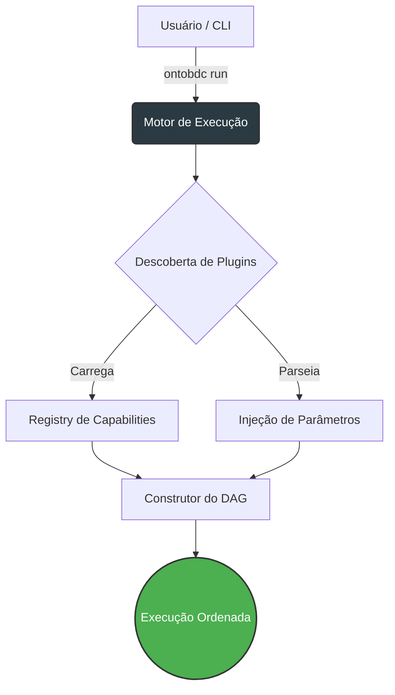
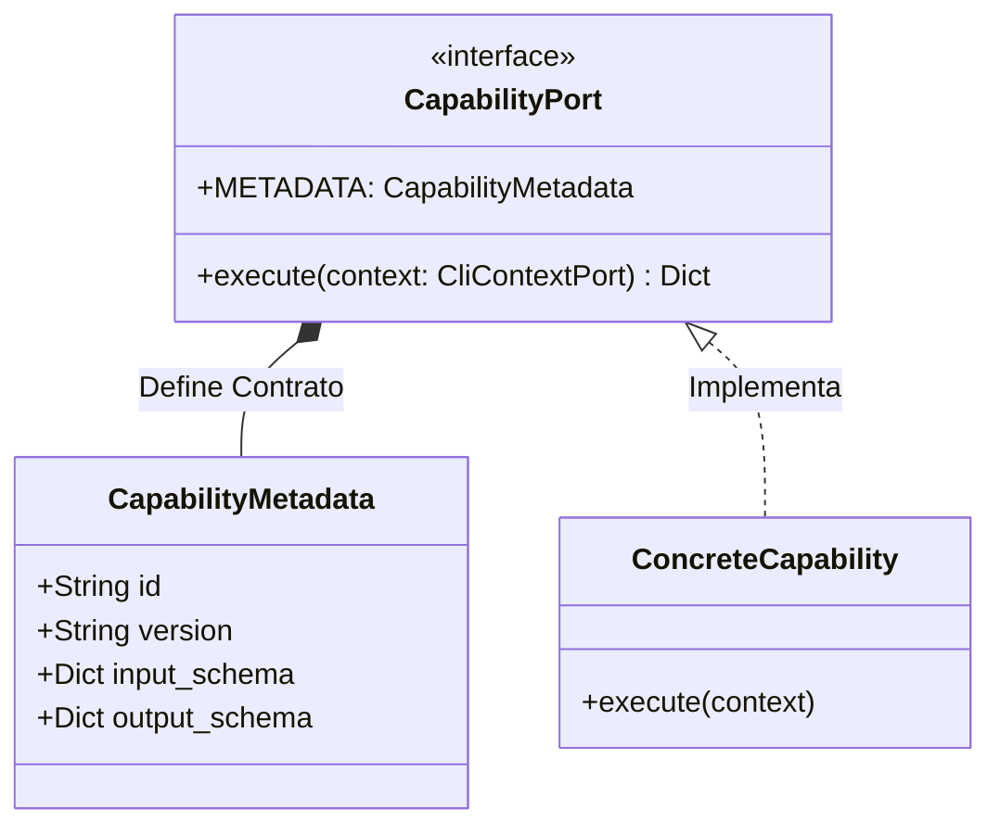
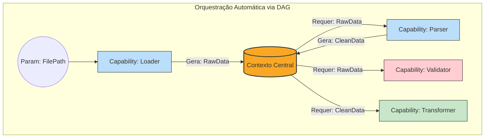

# OntoBDC: Arquitetura de Execução e Orquestração
## Technical Whitepaper

---

## 1. Introdução ao OntoBDC

O **OntoBDC** é um framework modular voltado ao processamento de dados, construção de ontologias e orquestração de rotinas complexas (ETL, federação, validações, entre outros) suportado por bases semânticas. 

A principal premissa de sua arquitetura é a extensibilidade. O OntoBDC não é apenas um conjunto de scripts, mas um *motor de execução* que permite plugar regras de negócio independentes, validar entradas de dados rigorosamente e orquestrar fluxos de trabalho que se conectam formando uma malha de processamento autônoma.

Este technical whitepaper foca exclusivamente no coração operacional do sistema: o módulo **`ontobdc run`**.

---

## 2. O Motor de Execução (`ontobdc run`)

O subcomando `ontobdc run` é o cérebro orquestrador do framework. Sua responsabilidade não é conhecer o domínio do problema (seja ele o armazenamento de dados BIM, infraestrutura ou validação semântica), mas sim **gerenciar o ciclo de vida do processamento**.

Quando o comando `run` é invocado, o motor realiza os seguintes passos:
1. **Descoberta**: Varre o sistema em busca de plugins/módulos disponíveis.
2. **Carregamento**: Instancia as *Capabilities* ativas.
3. **Resolução**: Lê os *Parameters* passados pelo usuário via CLI ou arquivo de configuração.
4. **Orquestração**: Constrói um *DAG* (Grafo Acíclico Dirigido) para definir a ordem de execução baseada nas dependências de entrada e saída.
5. **Execução**: Alimenta o *Context* e dispara as *Capabilities* na ordem topológica correta.

---

## 3. Capabilities: A Unidade Atômica de Processamento

No OntoBDC, qualquer ação que transforme, extraia ou valide dados é encapsulada em uma **Capability** (Capacidade). 

Uma Capability é uma classe isolada e independente. Para que o motor de execução entenda o que a Capability faz, ela deve expor um contrato rígido composto por duas partes: a **Metadata** e o método de **Execução**.

### 3.1 Metadata (`CapabilityMetadata`)
A metadata é o "RG" da Capability. Ela define:
* `id`: O identificador único global (ex: `org.ontobdc.transform.clean`).
* `description` e `tags`: Para documentação e busca.
* `input_schema`: Um contrato (geralmente baseado em JSON Schema ou tipos Python) que dita *exatamente* quais dados a Capability exige para funcionar.
* `output_schema`: A promessa do que a Capability vai gerar após rodar.

### 3.2 Contrato de Execução
A Capability deve implementar o método `execute(context: CliContextPort)`. É dentro deste escopo isolado que a regra de negócio acontece, consumindo recursos do contexto e devolvendo um estado resultante.

---

## 4. O Contexto de Execução (`Context`)

O `Context` (ou `CliContextPort`) atua como a "memória de curto prazo" (state container) do pipeline. 

Como as Capabilities são isoladas e não se comunicam diretamente umas com as outras, o Contexto serve como a ponte segura:
1. Ele armazena as instâncias globais necessárias (como conexões de banco ou repositórios).
2. Ele retém os **Parâmetros** de entrada injetados pelo usuário.
3. Ele armazena o **Output** de Capabilities que já rodaram, permitindo que Capabilities subsequentes solicitem esses dados.

A Capability nunca pergunta "Onde está a Capability anterior?". Ela pergunta ao Contexto: *"Me dê o valor do parâmetro X"*. Se o parâmetro X foi gerado por outra Capability ou injetado na CLI, isso é transparente para quem está consumindo.

---

## 5. Parâmetros e Validação (`Parameters`)

O OntoBDC trata Parâmetros como entidades de primeira classe. Um parâmetro não é apenas uma string de CLI; ele possui tipagem forte.

Antes de qualquer Capability ser executada, o Motor de Execução confronta os parâmetros existentes no *Context* contra o `input_schema` da Capability.
* Se um parâmetro exigido não existir, o fluxo falha na etapa de planejamento (Fail Fast).
* Se o parâmetro for de um tipo incompatível (ex: esperava-se um `Path` e chegou um `int`), a validação de schema levanta uma exceção antes da execução começar.

---

## 6. O Grafo Acíclico Dirigido (DAG)

A magia da orquestração do `ontobdc run` acontece na formação do **DAG**. 

Em rotinas ETL convencionais, o desenvolvedor escreve um script imperativo: `passo1()`, `passo2()`, `passo3()`. No OntoBDC, a orquestração é **declarativa e resolvida em tempo de execução**.

O Motor analisa as Capabilities registradas e cruza o `input_schema` de uma com o `output_schema` de outra.
* Se a *Capability B* precisa do dado `X`.
* E a *Capability A* promete gerar o dado `X` no seu output.
* O motor infere que **A deve rodar antes de B**.

Ao fazer isso para todas as Capabilities ativadas para a execução, o OntoBDC monta uma árvore de dependências. Como não podem haver ciclos (A depende de B que depende de A), a estrutura forma um Grafo Acíclico Dirigido (DAG).

### 6.1 Execução Topológica
Com o DAG formado, o motor aplica uma Ordenação Topológica (*Topological Sort*). Ele inicia a execução pelas Capabilities que não têm dependências pendentes (suas entradas já foram satisfeitas pela CLI). Conforme cada uma termina, seus resultados retroalimentam o Contexto, destravando e disparando as próximas Capabilities na fila, até que todo o fluxo seja concluído.

---

## 7. Conclusão

A arquitetura do `ontobdc run` foi desenhada para a **Descentralização**. O motor desconhece a lógica de negócios, as Capabilities desconhecem a origem exata de seus dados, e a ordem de execução é matematicamente garantida pelas promessas de schemas (DAG). Isso garante que o ecossistema do OntoBDC escale infinitamente, bastando adicionar novos plugins e declarando suas necessidades na Metadata.