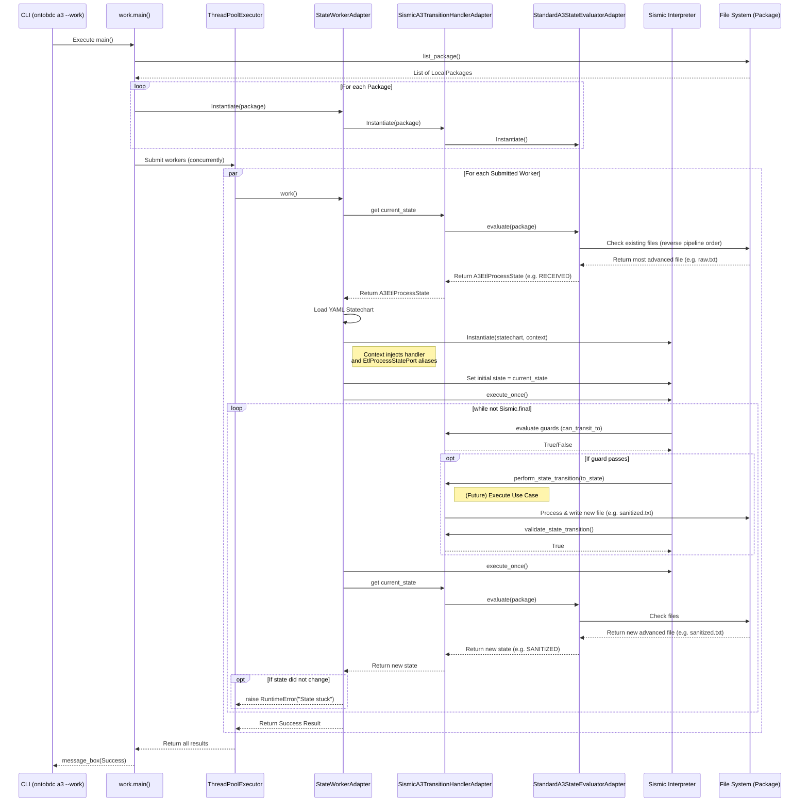

# SPEC 004 - Component Flows

## Status

- **Status**: Working specification of the current component flows
- **Scope**: OntoBDC core component flows exposed through the CLI
- **Primary sources**:
  - `docs/documentation/use_case`
  - `docs/documentation/spec/SPEC001_core_modules_and_commands.md`

## 1. Purpose

This specification describes the operational flows of each OntoBDC core component.

The goal is not to restate every command option. Instead, this document focuses on:

- what flow each component owns
- which states or checkpoints matter in that flow
- how the user and the system interact
- how one component hands work to another

This document complements:

- [SPEC001_core_modules_and_commands.md](file:///Users/eliasmpjunior/infobim/deploy/ontobdc-stack/docs/documentation/spec/SPEC001_core_modules_and_commands.md)

`SPEC001` describes the command surface and options. `SPEC004` describes the runtime flow of each component.

## 2. Flow Design Principles

Across the current core, the main design principles are:

- components own distinct operational responsibilities
- initialization is separated from execution
- validation can be invoked directly or as a gate before other actions
- package metadata, source data, and execution logic are layered
- some flows are command-driven while others are capability-driven

The current user-facing flow components are:

- `init`
- `check`
- `run`
- `list`
- `storage`
- `dev`
- `a3`

## 3. Flow Overview

### 3.1 Bootstrap Flow

Owned by:

- `init`

Purpose:

- establish the minimum local OntoBDC structure required for later operations

### 3.2 Validation Flow

Owned by:

- `check`

Purpose:

- validate whether the environment, engine, and dependencies are operational

### 3.3 Capability Execution Flow

Owned by:

- `run`

Purpose:

- discover capabilities, resolve execution context, and execute the selected capability

### 3.4 Capability Discovery Flow

Owned by:

- `list`

Purpose:

- expose the current catalog of available capabilities and their metadata

### 3.5 Dataset Registration Flow

Owned by:

- `storage`

Purpose:

- register, list, and remove dataset roots in the local storage index

### 3.6 Developer Workspace Flow

Owned by:

- `dev`

Purpose:

- coordinate repository-oriented developer actions and local dev configuration

### 3.7 A3 Lifecycle Flow

Owned by:

- `a3`

Purpose:

- ingest a source into an A3 lifecycle package and advance it through the A3 state machine

## 4. Component Flow Specifications

### 4.1 `init` Component Flow

#### Intent

The `init` component creates the local OntoBDC working structure for a project.

#### Main Flow

1. The user runs `ontobdc init` or `ontobdc init <engine>`.
2. The system checks whether `.__ontobdc__/config.yaml` already exists.
3. If configuration already exists, the system blocks duplicate initialization.
4. If no engine was provided, the system tries to infer one from the environment.
5. The system writes the selected engine and default configuration into `config.yaml`.
6. The system runs post-initialization checks to verify readiness.
7. The project becomes available to the remaining components.

#### Output

- initialized local configuration

### 4.2 `check` Component Flow

#### Intent

The `check` component validates whether the current project environment is safe and usable.

#### Main Flow

1. The user or another component invokes `ontobdc check`.
2. The system resolves project configuration and engine.
3. The system loads the enabled checks from configuration.
4. The system executes the selected checks sequentially.
5. Each check returns a status, and optionally a repair path.
6. The system aggregates the results and prints the final status.

#### Repair Flow

1. The user passes `--repair`.
2. Failing checks that expose repair logic attempt remediation.
3. The system reruns or reports the repaired state accordingly.

#### Output

- environment status
- failure points
- optional repair actions

### 4.3 `run` Component Flow

#### Intent

The `run` component is the main execution flow of OntoBDC capabilities.

#### Main Flow

1. The user runs `ontobdc run` with a capability identifier or selection parameters.
2. The system resolves repository and CLI context parameters.
3. The system loads capability packages and collects capability metadata.
4. The system applies filters, pagination, and export preferences.
5. If `--id` is present, the system resolves that capability directly.
6. If no explicit target is given, the system presents the capability selection flow.
7. The selected capability executes with the resolved context.
8. The system renders the result using the appropriate export strategy.

#### Failure Flow

1. The user provides an unknown capability identifier.
2. The system fails during capability resolution.
3. The system reports that the capability was not found.

#### Output

- executed capability result
- rendered output in terminal, JSON, or another selected format

### 4.4 `list` Component Flow

#### Intent

The `list` component exposes the discovery flow without executing capabilities.

#### Main Flow

1. The user runs `ontobdc list`.
2. The system scans the configured capability packages.
3. The system loads capability metadata.
4. The system deduplicates and normalizes the catalog view.
5. The system renders the result either as rich cards or JSON.

#### Output

- capability catalog
- capability metadata for later use by `run`

### 4.5 `storage` Component Flow

#### Intent

The `storage` component manages the local dataset registration flow, the root storage index, and the integrity of container-local metadata.

#### Main Flow (List)

1. The user runs `ontobdc storage --list` or `ontobdc storage -l`.
2. The system checks whether the storage extra dependencies are installed and `.__ontobdc__/storage.rdf` exists.
3. If no storage index exists or dependencies are missing, the system warns that storage has not been enabled.
4. If the storage index exists, the system parses the RDF graph and lists the registered containers.

#### Enablement Flow

1. The user runs `ontobdc storage --enable`.
2. The system installs the required storage dependencies (`ontobdc[storage]`).
3. The system creates the storage index `.__ontobdc__/storage.rdf` when necessary.
4. The system initializes the root storage container metadata.
5. The updated storage metadata is persisted.

#### Container Creation Flow

1. The user runs `ontobdc storage --create <path>`.
2. The system normalizes the target path relative to the project root.
3. The system loads the root `.__ontobdc__/storage.rdf`.
4. The system creates and persists a new container description in the root graph.
5. The system creates `<path>/.__ontobdc__/storage.rdf` when necessary.
6. The system copies the registered container triples from the root graph into the container-local `storage.rdf`.
7. The system creates `<path>/.__ontobdc__/ro-crate-metadata.json` when necessary.
8. The system refreshes the container RO-Crate metadata so that the local metadata file is up to date.

#### Storage Integrity Check Flow

The current storage-specific checks are owned by `storage/plugin/check`.

1. `has_container_config_file/check.py`
   - validates that each registered container has its local `.__ontobdc__` directory and `storage.rdf`
2. `is_root_set/check.py`
   - validates that the root storage graph contains the `::ROOT::` container
3. `is_crate_healthy/check.py`
   - validates that each container has a readable `ro-crate-metadata.json`

These checks are intentionally scoped:

- root validation is isolated from child-container validity
- container-config validation is isolated from full graph triple equality
- RO-Crate validation is isolated from RDF graph semantics

#### Storage Repair Flow

1. When a storage check exposes `hotfix.py`, repair recreates only the missing or stale artifact of that check.
2. `has_container_config_file/hotfix.py`
   - recreates missing container config directories and container `storage.rdf`
   - synchronizes root graph triples into container-local `storage.rdf`
3. `is_root_set/hotfix.py`
   - recreates the root `storage.rdf` if missing
   - ensures the `::ROOT::` container exists
4. `is_crate_healthy/hotfix.py`
   - recreates missing `ro-crate-metadata.json`
   - refreshes the crate metadata using the container directory as write target
   - excludes internal metadata files such as `storage.rdf` from the crate file listing

#### Output

- storage catalog
- updated dataset registration state
- repaired container-local metadata state

### 4.6 `dev` Component Flow

#### Intent

The `dev` component coordinates developer-oriented repository workflows.

#### Enablement Flow

1. The user runs `ontobdc dev --enable-dev-tool`.
2. The system writes `dev.tool: enabled` into local config.
3. Protected developer flows become available for the project.

#### Commit Flow

1. The user runs `ontobdc dev commit "<message>"`.
2. The system checks whether the dev tool is enabled.
3. The system validates the semantic commit message.
4. The system delegates to the repository commit script.

#### Branch Flow

1. The user runs `ontobdc dev branch`.
2. The system checks whether the dev tool is enabled.
3. The system delegates to the branch script.
4. The script inspects branch state across repositories.

#### Checkout Flow

1. The user runs `ontobdc dev checkout <name>`.
2. The system verifies dev enablement.
3. The system delegates checkout across the configured repositories.

#### SSH Key Flow

1. The user runs `ontobdc dev repo --add-ssh-key <path>` or `--rm-ssh-key`.
2. The system updates the local SSH key configuration.

#### Output

- updated local developer config
- repository state changes
- developer workflow feedback

### 4.7 `a3` Component Flow

#### Intent

The `a3` component owns the lifecycle flow for A3 packages.

It has two main operational flows:

- ingestion flow
- work processing flow

#### Ingestion Flow

1. The user runs `ontobdc a3 --etl --source <file|url>`.
2. The system verifies that A3 is enabled.
3. The system resolves an extraction strategy for the provided source.
4. The system extracts and normalizes the source content.
5. The system computes a deterministic package identifier.
6. The system writes `raw.txt` into the lifecycle package directory.

#### Work Flow

1. The user runs `ontobdc a3 --work`.
2. The system lists all lifecycle packages.
3. The system creates one worker per package.
4. Each worker evaluates the current package state from artifacts already on disk.
5. The worker initializes the A3 state machine at that physical state.
6. The worker performs valid transitions until it reaches a final state or an error.
7. Each successful transition writes the next artifact into the same package.

#### State Sequence

The canonical sequence is:

- `undefined`
- `received`
- `sanitized`
- `parsed`
- `translated`
- `validated`
- `reasoned`
- `dispatched`

#### A3 Work Sequence Diagram

#### Output

- lifecycle package artifacts
- final `event.jsonld` for dispatched packages
- failure diagnostics when a package gets stuck or invalid

## 5. Cross-Component Relationships

The components are not isolated. Their flows compose into a larger runtime lifecycle.

### 5.1 Initialization Before Execution

- `init` establishes the local structure
- `check`, `run`, `storage`, `dev`, and `a3` generally assume that structure exists

### 5.2 Validation As Gate

- `check` can be run explicitly by the user
- `dev` and initialization-related flows may invoke validation implicitly

### 5.3 Discovery Before Execution

- `list` exposes the discoverable capability surface
- `run` uses the same discovery logic for execution

### 5.4 Dataset And Package Orientation

- `storage` manages dataset roots and storage registration
- `a3` manages package lifecycles inside its own lifecycle area
- `index.rdf`, `nid.rdf`, and `datapackage.json` patterns fit into this broader package-oriented design

## 6. Summary

The OntoBDC core is organized around component flows rather than a single linear application pipeline.

Each component owns a distinct operational concern:

- `init` bootstraps
- `check` validates
- `run` executes capabilities
- `list` exposes the capability catalog
- `storage` manages dataset registration
- `dev` coordinates repository workflows
- `a3` runs lifecycle-based package processing

Together, these flows define the current runtime behavior of the platform at the component level.
