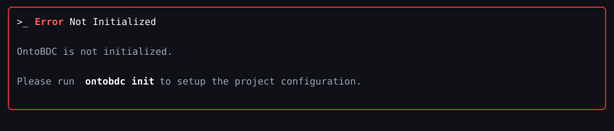
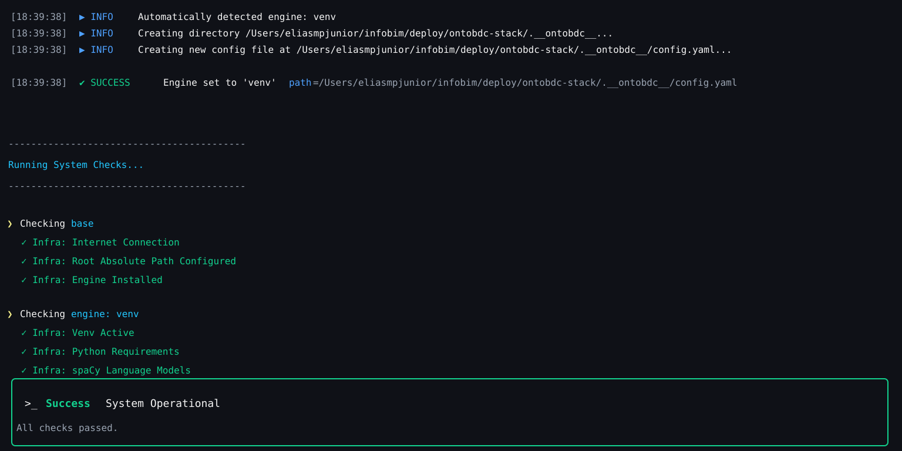
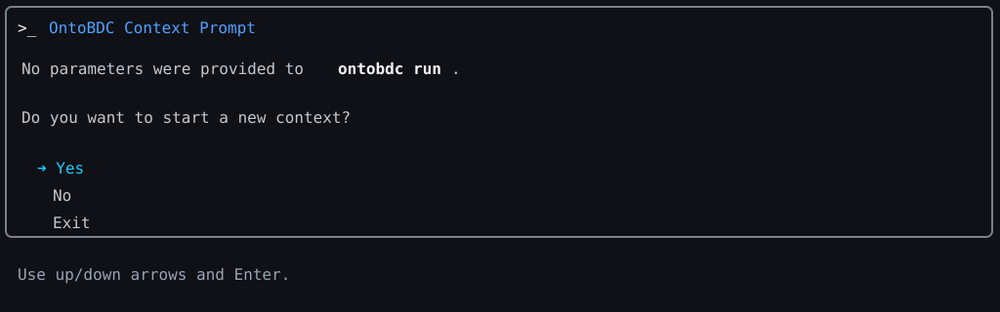

# ALTUC 001: OntoBDC Not Installed

## Status

Proposed

## Objective

Describe the alternative operational path in which a user intends to use OntoBDC, but the tool is not installed or is not available in the current execution environment.

## Context

The expected primary use cases assume that OntoBDC is installed, callable from the command line, and available in the current machine or runtime environment.

However, in real scenarios, a user may attempt to start a workflow before the tool is properly installed, configured, or exposed in the execution path.

This alternative use case captures that failure entry point and the minimum response expected from the surrounding process.

## Actors

- End user
- Local operating system or shell environment
- OntoBDC installation or bootstrap process

## Trigger

The alternative use case starts when the user attempts to execute OntoBDC, but the command is not installed, not found, or not available in the current environment.

## Preconditions

- the user intends to run OntoBDC
- the local environment does not provide a working OntoBDC executable

## Postconditions

- the user is informed that OntoBDC is not available
- the user receives enough guidance to proceed with installation or environment setup
- no business use case is executed until the installation issue is resolved

## Main Alternative Flow

1. The user attempts to invoke OntoBDC.
   Example:
   ```bash
   ontobdc run
   ```
2. The local environment fails to resolve the command or execute the tool correctly.
   Example:
   ```text
   zsh: command not found: ontobdc
   ```
3. The failure is identified as an installation or availability issue rather than a domain error.
   Example:
   ```text
   The command failed before any dataset, storage, or capability logic was executed.
   ```
4. The user is informed that OntoBDC is not installed or not accessible in the current environment.
   Example:
   ```text
   OntoBDC is not available in the current shell environment.
   ```
   Screenshot example:

   
5. The user is directed to the appropriate installation, initialization, or environment-setup step.
   Example:
   ```text
   Install OntoBDC or activate the correct environment, then retry `ontobdc run`.
   ```
6. The user performs the recovery step required to make OntoBDC operational.
   Example:
   ```bash
   ontobdc init
   ```
   Screenshot example:

   
7. The user retries the intended command after initialization to verify that OntoBDC is now operational.
   Example:
   ```bash
   ontobdc run
   ```
   Screenshot example:

   
8. The intended primary use case is postponed until OntoBDC becomes available.
   Example:
   ```text
   The schedule, task, or dataset workflow does not start until the CLI becomes operational.
   ```

## Alternative Flows

### AF1: OntoBDC is installed but not in the execution path

1. The user attempts to run the command.
   Example:
   ```bash
   ontobdc run
   ```
2. The shell cannot resolve the executable.
   Example:
   ```text
   zsh: command not found: ontobdc
   ```
3. The user is instructed to verify the installation path, shell configuration, or active environment.
   Example:
   ```text
   Verify PATH, shell profile, or the currently activated virtual environment.
   ```

### AF2: OntoBDC exists but dependencies are incomplete

1. The command is found, but execution fails due to missing dependencies or broken setup.
   Example:
   ```bash
   ontobdc run
   ```
2. The user is informed that OntoBDC is present but not operational.
   Example:
   ```text
   OntoBDC is installed, but required dependencies are missing or broken.
   ```
3. The user is directed to repair the installation or enable the required environment.
   Example:
   ```text
   Reinstall dependencies, rebuild the environment, or enable the required extras before retrying `ontobdc run`.
   ```

### AF3: The user is in the wrong project context

1. OntoBDC is installed, but the current directory is not initialized for the expected workflow.
   Example:
   ```bash
   ontobdc run
   ```
2. The user is informed that the tool is available but the project context is not ready.
   Example:
   ```text
   Error: OntoBDC is not initialized. Run 'ontobdc init'.
   ```
3. The user is directed to initialize the project or move to the correct root directory.
   Example:
   ```bash
   ontobdc init
   ```

## Business Rules

- installation and environment failures must be distinguished from domain or data failures
- the user must receive a clear next step rather than a silent failure
- no domain capability should run when the base tool is unavailable
- installation guidance should be concise and actionable

## Involved Data

This alternative use case does not depend on domain datasets.

The relevant technical signals may include:

- command availability in the shell
- executable path resolution
- environment activation state
- dependency availability
- project initialization state

## Expected Result

The user understands that the failure is infrastructural rather than business-related and knows what must be done next, such as:

- install OntoBDC
- activate the correct environment
- repair dependencies
- initialize the project
- retry the intended command after setup

## Architecture Notes

- this alternative use case sits before domain-level execution
- it concerns tool availability and runtime readiness rather than capability logic
- it is relevant to CLI entrypoint behavior, installation guidance, and environment diagnostics
- it should remain clearly separated from storage, dataset, and capability execution errors
