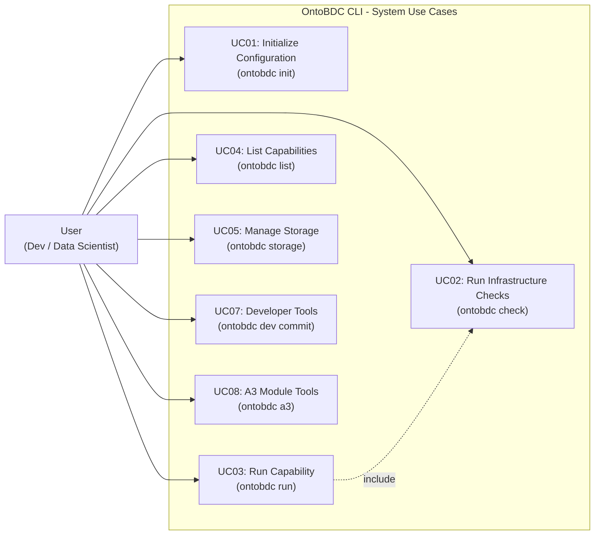

# Use Cases - OntoBDC Stack

This directory contains the documentation for the major OntoBDC CLI use cases currently exposed to the user.

## List of Use Cases

1. [UC01 - Initialize Configuration (init)](UC01_init.md)
2. [UC02 - Run Infrastructure Checks (check)](UC02_check.md)
3. [UC03 - Run Capability (run)](UC03_run.md)
4. [UC04 - List Capabilities (list)](UC04_list.md)
5. [UC05 - Manage Storage (storage)](UC05_storage.md)
6. [UC07 - Developer Tools (dev)](UC07_dev.md)
7. [UC08 - A3 Module Tools (a3)](UC08_a3.md)

---

## Use Case Diagram

The diagram below illustrates the interaction of the User (Developer / Data Scientist) with the main functionalities of the OntoBDC system.

## Capability Vocabulary
The current code expresses capability concepts through explicit capability interfaces rather than the older three-level hierarchy:

- **`QueryCapabilityPort`**: discovery and read-only inspection capabilities.
- **`TransformationCapabilityPort`**: capabilities that transform inputs into new or reshaped artifacts.
- **`ActionCapabilityPort`**: executable action capabilities used by the runtime.

The CLI use cases documented in this directory operate on top of that capability model.
