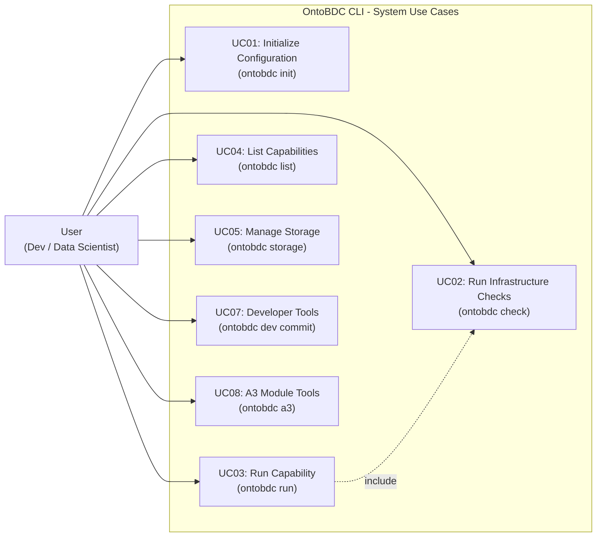

# Use Cases - OntoBDC Stack

This directory contains the documentation for all major use cases (System Level / L3) of the OntoBDC Stack project, mapped directly to the Command Line Interfaces (CLI) available to the user.

## List of Use Cases

1. [UC01 - Initialize Configuration (init)](UC01_init.md)
2. [UC02 - Run Infrastructure Checks (check)](UC02_check.md)
3. [UC03 - Run Capability (run)](UC03_run.md)
4. [UC04 - List Capabilities (list)](UC04_list.md)
5. [UC05 - Manage Storage (storage)](UC05_storage.md)
6. [UC07 - Developer Tools (dev)](UC07_dev.md)
7. [UC08 - A3 Module Tools (a3)](UC08_a3.md)

---

## Use Case Diagram

The diagram below illustrates the interaction of the User (Developer / Data Scientist) with the main functionalities of the OntoBDC system.

## Three-Level Agent Architecture
According to the project's architecture guidelines, the listed CLI commands act as orchestrators (L3 Use Cases) that modify business or environment states, utilizing:
- **L1 Capabilities**: Discovery/read-only tools (e.g., data extraction via `ontobdc run`).
- **L2 Actions**: Local transformation tools.
- **L3 Use Cases**: Commands and flows that change the system state (e.g., `init`, `storage add`, `dev commit`).
